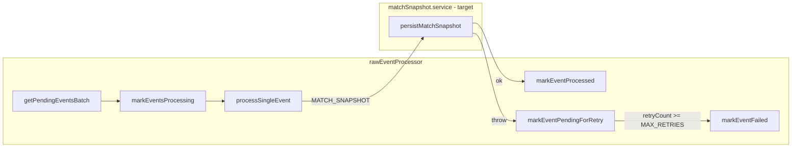

# REQ-SRV-02 — Acceptance boundary

Maps requirement text to exact worker persistence assertions. Issue [#17](https://github.com/st998814/LOL-Custom-Game-Logger/issues/17); branch `req-srv-02-worker-persistence`.

## Requirement source

| Field | Value |
|-------|-------|
| **ID** | REQ-SRV-02 |
| **Tier** | P0 |
| **Epic** | US-1 |
| **Task** | Worker processes `MATCH_SNAPSHOT` events and persists to **PostgreSQL**. |
| **Note** | Prisma models: `Match`, `Player`, `MatchPlayer`, `RawEvent`. |

## Scope (grill-me resolved)

| In scope | Out of scope |
|----------|--------------|
| Verify + harden worker persistence | Winner derivation (`REQ-SRV-07`) |
| Assert core persisted field values | Null/`0000…` puuid identity hardening |
| Extract `matchSnapshot.service` | Full HTTP queue-path integration test |
| Fail if <2 valid `match_players` | Telegram, client, read APIs |
| Fail (retry → `FAILED`) if `matches` row exists for `game_id` | Full `REQ-SRV-06` dedupe story |

## Processing flow

**Current code:** persistence lives inline in `ingestMatchSnapshot()` inside `rawEventProcessor.ts`.  
**Target code:** `matchSnapshot.service.ts` owns persistence; worker orchestrates status transitions only.

---

## Assertion map

### A. Raw event lifecycle (worker orchestration)

| # | Requirement clause | Code owner | Assertion | Current | Target |
|---|-------------------|------------|-----------|---------|--------|
| A1 | Worker processes queued events | `rawEventProcessor.processBatch` | Polls `raw_events` where `status = PENDING`, oldest first, batch ≤ 20 | Implemented | Keep |
| A2 | — | `rawEvent.model.markEventsProcessing` | Selected events → `PROCESSING`; `retryCount` incremented | Implemented | Keep |
| A3 | Worker processes `MATCH_SNAPSHOT` | `processSingleEvent` | `eventType === 'MATCH_SNAPSHOT'` routes to persistence | Implemented | Route via service |
| A4 | — | `markEventProcessed` | On success: `status = PROCESSED`, `processedAt` set, `errorMessage = null` | Implemented | Keep |
| A5 | `REQ-OPS-02` (bounded retries) | `processBatch` catch | On throw: if `retryCount + 1 < MAX_RETRIES` (5) → `PENDING` + `errorMessage`; else → `FAILED` | Implemented | Keep |
| A6 | — | `processSingleEvent` | Unknown `eventType` throws → retry/fail path | Implemented | Keep |

**Test hooks:** export `processSingleEvent` and/or `processBatch` for unit tests; do not start the infinite loop in tests.

---

### B. Match persistence (`matches` table)

Maps partially to **REQ-SRV-03** field storage; asserted here because worker writes these rows.

| # | Field / rule | Payload key(s) | DB column | Assertion | Current | Target |
|---|--------------|----------------|-----------|-----------|---------|--------|
| B1 | `gameId` | `match.game_id` (or camelCase fallback) | `matches.game_id` PK | Exactly one row; value equals payload | Upsert by PK | **Reject** if row already exists (throw) |
| B2 | `gameDuration` | `match.game_duration` | `matches.game_duration` | Int equals payload | Upsert update/create | Persist on create only (no update path if duplicate rejected) |
| B3 | `gameCreationDate` | `match.game_creation_date` | `matches.game_creation_date` | `Date` equals parsed ISO string | Upsert | Persist on create only |
| B4 | Missing match object | — | — | Throw: missing `"match"` | Implemented | Keep |
| B5 | Missing match fields | — | — | Throw if `gameId`, `gameDuration`, or `gameCreationDate` absent/invalid | Implemented | Keep |
| B6 | Invalid date | — | — | Throw if `game_creation_date` not parseable | Implemented | Keep |

**Fixture reference:** `server/tests/fixtures/match-snapshot.json` → `game_id: 695827639`, `game_duration: 628`, `game_creation_date: "2026-03-16T12:32:09.240Z"`.

---

### C. Player persistence (`players` table)

Maps partially to **REQ-SRV-04** field storage.

| # | Field / rule | Payload key | DB column | Assertion | Current | Target |
|---|--------------|-------------|-----------|-----------|---------|--------|
| C1 | `puuid` | `players[].puuid` | `players.puuid` | Trim; empty/`^0+$/` → `null`; else upsert by `puuid` | Implemented | Keep (fixtures use real puuids only) |
| C2 | `gameName` | `players[].game_name` | `players.game_name` | String or `null` | Implemented | Assert equals payload |
| C3 | `tagLine` | `players[].tag_line` | `players.tag_line` | String or `null` | Implemented | Assert equals payload |
| C4 | Upsert by puuid | — | — | Existing `puuid` updates `gameName`/`tagLine` | Implemented | Keep |
| C5 | Null puuid | — | — | Creates new `Player` row with `puuid = null` | Implemented | **Deferred** — not tested this issue |

---

### D. Match-player persistence (`match_players` table)

| # | Field / rule | Payload key | DB column | Assertion | Current | Target |
|---|--------------|-------------|-----------|-----------|---------|--------|
| D1 | `participantId` | `players[].participant_id` | `match_players.participant_id` | Part of composite PK `(game_id, participant_id)` | Implemented | Assert equals payload |
| D2 | `teamId` | `players[].team_id` | `match_players.team_id` | Int equals payload; unique per `(game_id, team_id)` | Implemented | Assert equals payload |
| D3 | `championId` | `players[].champion_id` | `match_players.champion_id` | Int equals payload | Implemented | Assert equals payload |
| D4 | `firstBlood` | `players[].first_blood` | `match_players.first_blood` | Boolean; default `false` if absent | Implemented | Assert equals payload |
| D5 | `firstTower` | `players[].first_tower` | `match_players.first_tower` | Boolean; default `false` if absent | Implemented | Assert equals payload |
| D6 | `totalCs` | `players[].total_cs` | `match_players.total_cs` | Int; default `0` if absent | Implemented | Assert equals payload |
| D7 | Row count | — | — | Exactly **2** `match_players` rows for the `game_id` | Not enforced | **Throw** if <2 valid players persisted |
| D8 | 1v1 constraint | — | — | DB `UNIQUE (game_id, team_id)` | Schema only | Rely on ingest `players.length === 2` + D7; full `REQ-SRV-05` separate |

**Malformed player entry** (missing `participant_id`, `team_id`, or `champion_id`):

| Current | Target |
|---------|--------|
| Skip entry silently; may still mark `PROCESSED` with <2 rows | Count valid entries; if <2 after loop → throw → retry → `FAILED` |

---

### E. Transaction boundary

| # | Assertion | Current | Target |
|---|-----------|---------|--------|
| E1 | `Match`, `Player`, `MatchPlayer` writes occur in one Prisma `$transaction` | Implemented in `ingestMatchSnapshot` | Move to `matchSnapshot.service` |
| E2 | Failure rolls back all ledger writes for that snapshot | Implicit via transaction | Keep |

---

### F. Deferred adjacent requirements

| Requirement | Why deferred | Worker touchpoint |
|-------------|--------------|-------------------|
| REQ-SRV-05 (1v1 per team) | DB constraint + ingest validation sufficient for MVP path | `@@unique([gameId, teamId])` |
| REQ-SRV-06 (ledger dedupe) | Ingest dedup + partial duplicate-match guard here | Ingest `409`; service rejects existing `matches` row |
| REQ-SRV-07 (winner) | No `winner` column in schema | Not in worker today |
| REQ-SRV-08 (validation error on raw event) | Partially covered by A5 (`errorMessage`) | Full admin replay UX is P1 |

---

## Happy-path assertion checklist (test contract)

Given `server/tests/fixtures/match-snapshot.json` with unique `game_id`:

### Service (`matchSnapshot.service`)

- [x] **S1** — No pre-existing `matches` row for `game_id`
- [x] **S2** — `matches`: 1 row with `game_id`, `game_duration`, `game_creation_date` matching payload
- [x] **S3** — `players`: 2 rows (upserted by `puuid`) with `game_name`, `tag_line` matching payload
- [x] **S4** — `match_players`: 2 rows linked to `game_id` with `participant_id`, `team_id`, `champion_id`, `first_blood`, `first_tower`, `total_cs` matching payload
- [x] **S5** — All writes in single transaction

### Worker (`rawEventProcessor`)

- [x] **W1** — `PENDING` event with valid payload → `PROCESSED`, `processedAt` set
- [x] **W2** — Service throw → `PENDING` + `errorMessage` while `retryCount < 5`
- [x] **W3** — Service throw on 5th attempt → `FAILED` + `errorMessage`

### Failure paths

- [x] **F1** — Payload with 1 valid player + 1 malformed → throw; no partial ledger commit
- [x] **F2** — `matches` row already exists for `game_id` → throw; retry → `FAILED`
- [x] **F3** — Missing `match` or empty `players` → throw before DB writes

---

## Current vs target gaps (implementation backlog)

| Gap | Location | Action |
|-----|----------|--------|
| Persistence inline in worker | `rawEventProcessor.ts` | Done — `matchSnapshot.service.ts` |
| Silent skip of malformed players | `matchSnapshot.service.ts` | Done — throw if valid count < 2 |
| Upsert on duplicate `game_id` | `matchSnapshot.service.ts` | Done — reject existing match |
| No worker/service tests | `*.test.ts` | Done — unit coverage (mocked) |
| `processSingleEvent` not exported | `rawEventProcessor.ts` | Done |

---

## Code references

| Module | Path | Role |
|--------|------|------|
| Worker loop | `server/src/workers/rawEventProcessor.ts` | Poll, dispatch, status transitions |
| Raw event model | `server/src/models/rawEvent.model.ts` | Queue queries + status updates |
| Prisma schema | `server/prisma/schema.prisma` | `Match`, `Player`, `MatchPlayer`, `RawEvent` |
| Fixture | `server/tests/fixtures/match-snapshot.json` | Canonical `MATCH_SNAPSHOT` shape |
| Fixture helpers | `server/tests/helpers/ingestFixtures.ts` | `loadMatchSnapshotFixture`, `withGameId` |

---

## Next step

Implement `matchSnapshot.service.ts` using assertions **B–E** and wire **A** in the worker. Tests should assert checklist items **S1–S5**, **W1–W3**, **F1–F3**.
