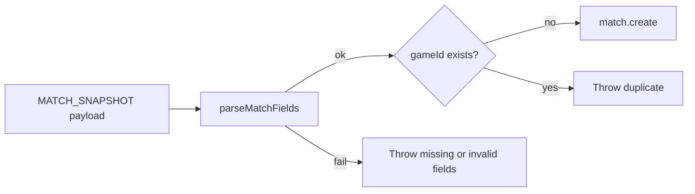

# REQ-SRV-03 — Acceptance boundary

Maps requirement text to match-field persistence and `gameId` uniqueness assertions. Issue [#19](https://github.com/st998814/LOL-Custom-Game-Logger/issues/19); branch `req-srv-03-verify-match-fields`.

## Requirement source

| Field | Value |
|-------|-------|
| **ID** | REQ-SRV-03 |
| **Tier** | P0 |
| **Epic** | US-1 |
| **Task** | Server stores per-match fields: `gameId`, `gameDuration`, `gameCreationDate`. |
| **Note** | `gameId` is the primary key; duplicates are rejected. |

## Scope

| In scope | Out of scope |
|----------|--------------|
| Persist `gameId`, `gameDuration`, `gameCreationDate` on `matches` | Player fields (`REQ-SRV-04`) |
| `gameId` as Match `@id` (PK) | `(gameId, teamId)` uniqueness (`REQ-SRV-05`) |
| Reject when a `matches` row already exists for `gameId` | Ingest / `deduplicationKey` dedupe (`REQ-SRV-06`) |
| Reject missing or invalid basic match fields | Winner derivation (`REQ-SRV-07`) |
| Unit + integration proof | Worker status lifecycle (`REQ-SRV-02` — already closed) |

## Persistence flow

**Code owner:** `server/src/services/matchSnapshot.service.ts` (`parseMatchFields`, `persistMatchSnapshot`).

---

## Assertion map

### A. Match fields (`matches` table)

| # | Field / rule | Payload key(s) | DB column | Assertion | Status |
|---|--------------|----------------|-----------|-----------|--------|
| A1 | `gameId` | `match.game_id` (camelCase fallback) | `matches.game_id` PK | Value equals payload; exactly one row | Implemented + tested |
| A2 | `gameDuration` | `match.game_duration` (camelCase fallback) | `matches.game_duration` | Int equals payload | Implemented + tested |
| A3 | `gameCreationDate` | `match.game_creation_date` (camelCase fallback) | `matches.game_creation_date` | `Date` equals parsed ISO string | Implemented + tested |
| A4 | Missing `match` object | — | — | Throw: missing `"match"` | Implemented + tested |
| A5 | Missing `game_id` or `game_duration` | — | — | Throw: `missing basic match fields`; no DB write | Implemented + tested |
| A6 | Invalid date | — | — | Throw: `invalid game_creation_date`; no DB write | Implemented + tested |

**Fixture reference:** `server/tests/fixtures/match-snapshot.json` → `game_duration: 628`, `game_creation_date: "2026-03-16T12:32:09.240Z"` (tests override `game_id` via `withGameId`).

### B. Primary key and duplicate rejection

| # | Rule | Mechanism | Assertion | Status |
|---|------|-----------|-----------|--------|
| B1 | `gameId` is Match PK | Prisma `gameId Int @id` | Schema enforces one row per game | Implemented |
| B2 | Duplicate `gameId` rejected | `findUnique` then throw before transaction | Message `Match already exists for game_id {id}`; no second row | Implemented + tested |

### C. Sibling requirement boundaries

| Sibling | Owns | Not asserted here |
|---------|------|-------------------|
| REQ-SRV-02 | Worker → `persistMatchSnapshot` orchestration | Raw event `PROCESSED` / retry |
| REQ-SRV-04 | Per-player ledger fields | `puuid`, champion, CS, etc. |
| REQ-SRV-05 | At most one player per `teamId` | `@@unique([gameId, teamId])` |
| REQ-SRV-06 | Ingest dedupe by `deduplicationKey` | HTTP `409` / raw-event unique key |

---

## Test hooks

| Layer | File | Covers |
|-------|------|--------|
| Unit | `server/src/services/matchSnapshot.service.test.ts` | Field mapping, missing fields, invalid date, duplicate reject |
| Integration | `server/tests/integration/matchSnapshot.integration.test.ts` | Live DB field values + duplicate leaves one row |
| Schema | `server/prisma/schema.prisma` | `Match.gameId` `@id` |
