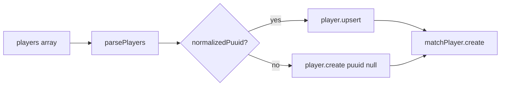

# REQ-SRV-04 — Acceptance boundary

Maps requirement text to per-player field persistence and `puuid` normalization. Issue [#21](https://github.com/st998814/LOL-Custom-Game-Logger/issues/21); branch `req-srv-04-verify-player-fields`.

## Requirement source

| Field | Value |
|-------|-------|
| **ID** | REQ-SRV-04 |
| **Tier** | P0 |
| **Epic** | US-1 |
| **Task** | Server stores per-player fields: `puuid`, `gameName`, `tagLine`, `championId`, `firstBlood`, `firstTower`, `totalCs`, `teamId`. |
| **Note** | Aligns with LCU snapshot schema; normalize empty/`0000…` puuid to null. |

## Scope

| In scope | Out of scope |
|----------|--------------|
| Persist eight player fields on `players` / `match_players` | Match fields (`REQ-SRV-03`) |
| Normalize empty / `/^0+$/` `puuid` to `null` | `(gameId, teamId)` uniqueness (`REQ-SRV-05`) |
| Real `puuid` upserts; null `puuid` creates | Ingest dedupe (`REQ-SRV-06`) |
| Unit + integration proof | Winner derivation (`REQ-SRV-07`) |

## Persistence flow

**Code owner:** `server/src/services/matchSnapshot.service.ts` (`parsePlayers`, `persistMatchSnapshot`).

---

## Assertion map

### A. Player identity (`players` table)

| # | Field / rule | Payload key | DB column | Assertion | Status |
|---|--------------|-------------|-----------|-----------|--------|
| A1 | `puuid` (real) | `players[].puuid` | `players.puuid` | Upsert by `puuid` | Implemented + tested |
| A2 | `puuid` empty / `/^0+$/` | `players[].puuid` | `players.puuid` | Stored as `null` via `create` | Implemented + tested |
| A3 | `gameName` | `players[].game_name` | `players.game_name` | String or `null` equals payload | Implemented + tested |
| A4 | `tagLine` | `players[].tag_line` | `players.tag_line` | String or `null` equals payload | Implemented + tested |

### B. Match-player stats (`match_players` table)

| # | Field / rule | Payload key | DB column | Assertion | Status |
|---|--------------|-------------|-----------|-----------|--------|
| B1 | `teamId` | `players[].team_id` | `match_players.team_id` | Int equals payload | Implemented + tested |
| B2 | `championId` | `players[].champion_id` | `match_players.champion_id` | Int equals payload | Implemented + tested |
| B3 | `firstBlood` | `players[].first_blood` | `match_players.first_blood` | Boolean equals payload | Implemented + tested |
| B4 | `firstTower` | `players[].first_tower` | `match_players.first_tower` | Boolean equals payload | Implemented + tested |
| B5 | `totalCs` | `players[].total_cs` | `match_players.total_cs` | Int equals payload | Implemented + tested |

### C. Sibling requirement boundaries

| Sibling | Owns | Not asserted here |
|---------|------|-------------------|
| REQ-SRV-03 | Match columns + `gameId` PK | `gameDuration`, duplicate match |
| REQ-SRV-05 | At most one player per `teamId` | `@@unique([gameId, teamId])` |
| REQ-SRV-06 | Ingest dedupe by `deduplicationKey` | HTTP `409` |
| REQ-SRV-07 | Match winner | No winner column yet |

---

## Test hooks

| Layer | File | Covers |
|-------|------|--------|
| Unit | `server/src/services/matchSnapshot.service.test.ts` | Field mapping; empty / all-zero → `puuid` null create |
| Integration | `server/tests/integration/matchSnapshot.integration.test.ts` | Live DB field values + null `puuid` rows |
| Schema | `server/prisma/schema.prisma` | `Player` / `MatchPlayer` columns |
