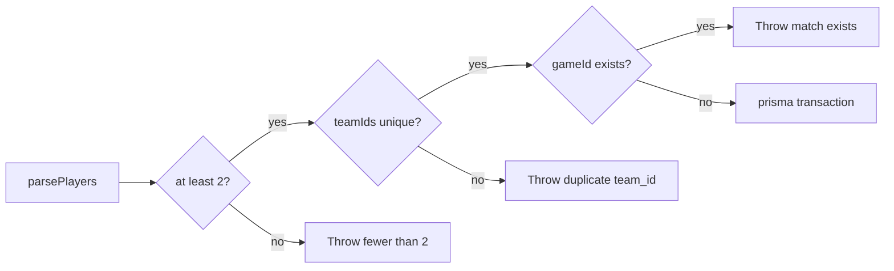

# REQ-SRV-05 — Acceptance boundary

Maps requirement text to 1v1 enforcement via `(gameId, teamId)` uniqueness. Issue [#22](https://github.com/st998814/LOL-Custom-Game-Logger/issues/22); branch `req-srv-05-enforce-1v1-team-unique`.

## Requirement source

| Field | Value |
|-------|-------|
| **ID** | REQ-SRV-05 |
| **Tier** | P0 |
| **Epic** | US-1 |
| **Task** | Server enforces **1v1 per match** (at most one row per `teamId` per game). |
| **Note** | DB unique constraint on `(gameId, teamId)`. |

## Scope

| In scope | Out of scope |
|----------|--------------|
| DB `@@unique([gameId, teamId])` on `MatchPlayer` | Client 2-player length (`REQ-CAP-04`) |
| App fail-fast when parsed players share `teamId` | Player field storage (`REQ-SRV-04`) |
| Reject path leaves no partial ledger rows | Ingest dedupe (`REQ-SRV-06`) |
| Unit + integration proof | Winner derivation (`REQ-SRV-07`) |

## Enforcement flow

**Code owners:**

- App: `server/src/services/matchSnapshot.service.ts`
- DB: `server/prisma/schema.prisma` (`match_players_game_team_unique`)

---

## Assertion map

### A. Database constraint

| # | Rule | Mechanism | Assertion | Status |
|---|------|-----------|-----------|--------|
| A1 | At most one row per `(gameId, teamId)` | Prisma `@@unique([gameId, teamId])` | Present in schema + migration | Implemented |
| A2 | Constraint name | `match_players_game_team_unique` | Migrated in first Prisma migration | Implemented |

### B. Application fail-fast

| # | Rule | Mechanism | Assertion | Status |
|---|------|-----------|-----------|--------|
| B1 | Duplicate `teamId` among parsed players | `Set(teamIds).size !== teamIds.length` | Throw before `findUnique` / `$transaction` | Implemented + tested |
| B2 | Error message | Clear string | `MATCH_SNAPSHOT must not have duplicate team_id values` | Implemented + tested |
| B3 | No partial writes | Pre-transaction throw | Zero `matches` / `match_players` for that `gameId` | Implemented + tested |

### C. Sibling requirement boundaries

| Sibling | Owns | Not asserted here |
|---------|------|-------------------|
| REQ-CAP-04 | Client `participantIdentities.length === 2` | Client skip path |
| REQ-SRV-04 | Per-player ledger fields | `puuid` normalize |
| REQ-SRV-06 | Ingest `deduplicationKey` / HTTP `409` | Raw-event unique key |
| REQ-SRV-07 | Match winner | No winner column yet |

---

## Test hooks

| Layer | File | Covers |
|-------|------|--------|
| Unit | `server/src/services/matchSnapshot.service.test.ts` | Duplicate `team_id` → throw; no DB calls |
| Integration | `server/tests/integration/matchSnapshot.integration.test.ts` | Live DB: reject + zero ledger rows; happy path 100/200 |
| Schema | `server/prisma/schema.prisma` | `@@unique([gameId, teamId])` |
