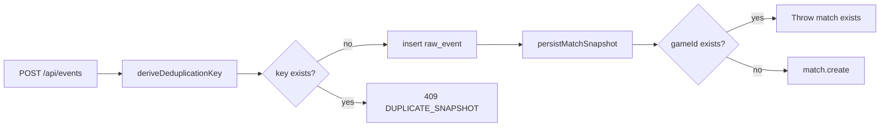

# REQ-SRV-06 — Acceptance boundary

Maps requirement text to ingest/ledger deduplication. Issue [#23](https://github.com/st998814/LOL-Custom-Game-Logger/issues/23); branch `req-srv-06-verify-ingest-dedupe`.

## Requirement source

| Field | Value |
|-------|-------|
| **ID** | REQ-SRV-06 |
| **Tier** | P0 |
| **Epic** | US-1 |
| **Task** | Server deduplicates ingest by `gameId` / deduplication key. |
| **Note** | Same game must not create two ledger entries. |

## Scope

| In scope | Out of scope |
|----------|--------------|
| Derive `MATCH_SNAPSHOT:{game_id}` or use explicit `deduplicationKey` | Client treats `409` as idempotent success (#15 / P1) |
| Front guard → `409 DUPLICATE_SNAPSHOT` | Match field storage (`REQ-SRV-03` owns PK semantics) |
| DB unique on `raw_events.deduplication_key` (+ `P2002` → `409`) | Winner (`REQ-SRV-07`) |
| Ledger backstop: existing `matches.gameId` reject | New migrations |

## Three-layer story

| Layer | Owner | What it prevents |
|-------|-------|------------------|
| 1. HTTP ingest | `rawEvent.service.ts` | Second raw event for same dedup key |
| 2. DB unique | `raw_events_dedupe_key_unique` | Race insert duplicates |
| 3. Match PK reject | `matchSnapshot.service.ts` | Second `matches` row if worker path is hit twice |

**Boundary vs REQ-SRV-03:** REQ-SRV-03 owns storing match fields and `gameId` as PK / reject-on-existing-match. REQ-SRV-06 owns the **ingest-key** story and the end-to-end “one ledger entry per game” guarantee across layers 1–3.

---

## Assertion map

### A. Key derivation

| # | Rule | Assertion | Status |
|---|------|-----------|--------|
| A1 | From `match.game_id` | Key = `MATCH_SNAPSHOT:{game_id}` | Implemented + tested |
| A2 | Explicit `deduplicationKey` | Client-supplied non-empty string used as-is | Implemented + tested |

### B. Ingest reject

| # | Rule | Assertion | Status |
|---|------|-----------|--------|
| B1 | Front guard | Existing key → `DuplicateSnapshotError` / HTTP `409` | Implemented + tested |
| B2 | One raw_event row | Duplicate POST leaves count = 1 | Implemented + tested |
| B3 | Race fallback | Prisma `P2002` → `409 DUPLICATE_SNAPSHOT` | Implemented + tested |

### C. Ledger backstop (shared with REQ-SRV-03)

| # | Rule | Assertion | Status |
|---|------|-----------|--------|
| C1 | Existing match | `Match already exists for game_id …`; no second row | Proven under REQ-SRV-03 |

### D. Sibling boundaries

| Sibling | Owns | Not this issue |
|---------|------|----------------|
| REQ-SRV-01 | Queue `PENDING` raw events | General ingest contract (already Done) |
| REQ-SRV-03 | Match columns + PK uniqueness | Verified separately; cited here as layer 3 |
| #15 | Client `409` → `READY` | P1 polish |

---

## Test hooks

| Layer | File | Covers |
|-------|------|--------|
| Unit | `server/src/services/rawEvent.service.test.ts` | Derive key, explicit key, front guard, `P2002` |
| Unit / HTTP | `server/src/routes/rawEvent.route.test.ts`, `ingestHttp.test.ts` | `409` mapping |
| Integration | `server/tests/integration/ingest.integration.test.ts` | Live `202` then `409`; one raw_event row |
| Integration | `server/tests/integration/matchSnapshot.integration.test.ts` | Duplicate `gameId` persist → one match |
| Schema | `server/prisma/schema.prisma` | `@@unique([deduplicationKey])` |
