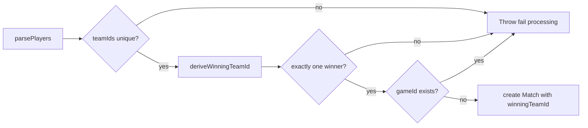

# REQ-SRV-07 — Acceptance boundary

Maps requirement text to DEC-001 duel win judgement and stored `Match.winningTeamId`. Issue [#24](https://github.com/st998814/LOL-Custom-Game-Logger/issues/24); branch `req-srv-07-derive-store-winner`.

## Requirement source

| Field | Value |
|-------|-------|
| **ID** | REQ-SRV-07 |
| **Tier** | P0 |
| **Epic** | US-2 |
| **Task** | Server derives and stores match **winner** from captured outcome data. |
| **Note** | House rule: FB **or** first tower **or** CS≥100; store at persist; fail if neither/ambiguous. See [DEC-001](../../05-knowledge/Decisions.md#dec-001--custom-duel-win-judgement). |

## Scope

| In scope | Out of scope |
|----------|--------------|
| `Match.winningTeamId` column + migration | Telegram `/stats` UI (`REQ-BOT-01`–`03`) |
| `deriveWinningTeamId` / `playerQualifies` (DEC-001 OR rule) | LCU nexus / Riot `stats.win` |
| Fail processing when neither / ambiguous / conflicting exclusive flags | Query-time-only W/L derivation |
| Store winner once in `persistMatchSnapshot` | Optional win-reason display column |
| Unit + integration proof | Raw-event error recording polish (`REQ-SRV-08`) |

## Winner derivation flow

**Code owners:**

- App: `server/src/services/matchSnapshot.service.ts` (`playerQualifies`, `deriveWinningTeamId`, `persistMatchSnapshot`)
- DB: `server/prisma/schema.prisma` (`matches.winning_team_id`)

**Decision reference:** [DEC-001](../../05-knowledge/Decisions.md#dec-001--custom-duel-win-judgement)

---

## Assertion map

### A. Win rule (DEC-001 OR)

| # | Rule | Mechanism | Assertion | Status |
|---|------|-----------|-----------|--------|
| A1 | First blood wins | `player.firstBlood` | Qualifying player’s `teamId` stored | Implemented + tested |
| A2 | First tower wins | `player.firstTower` | Qualifying player’s `teamId` stored | Implemented + tested |
| A3 | CS ≥ 100 wins | `player.totalCs >= 100` | Qualifying player’s `teamId` stored | Implemented + tested |
| A4 | Flat OR (no priority) | Single `playerQualifies` check | Any one condition suffices | Implemented + tested |

### B. Persist form

| # | Rule | Mechanism | Assertion | Status |
|---|------|-----------|-----------|--------|
| B1 | Store at persist | `match.create({ winningTeamId })` | Column set on successful persist | Implemented + tested |
| B2 | Derive before transaction | Call after team-uniqueness, before `$transaction` | Fail paths skip DB writes | Implemented + tested |
| B3 | Column shape | `Match.winningTeamId` → `matches.winning_team_id` | Required `Int` (100 or 200) | Implemented + migrated |

### C. Failure semantics

| # | Situation | Expected | Assertion | Status |
|---|-----------|----------|-----------|--------|
| C1 | Neither qualifies | Fail processing | `MATCH_SNAPSHOT has no contestable winner` | Implemented + tested |
| C2 | Both qualify (e.g. both CS ≥ 100) | Fail processing | `MATCH_SNAPSHOT has ambiguous winner` | Implemented + tested |
| C3 | Both `firstBlood` true | Fail processing | `conflicting first_blood flags` | Implemented + tested |
| C4 | Both `firstTower` true | Fail processing | `conflicting first_tower flags` | Implemented + tested |
| C5 | No partial ledger rows on fail | Pre-transaction throw | Zero `matches` / `match_players` for that `gameId` | Implemented + tested |

### D. Sibling requirement boundaries

| Sibling | Owns | Not asserted here |
|---------|------|-------------------|
| REQ-SRV-04 | Evidence fields (`firstBlood`, `firstTower`, `totalCs`) | Field parsing / normalization |
| REQ-SRV-05 | 1v1 `(gameId, teamId)` uniqueness | Duplicate team guard |
| REQ-SRV-06 | Ingest dedupe | HTTP `409` |
| REQ-BOT-01–03 | Telegram stats UX | Bot reads stored winner later |

---

## Test hooks

| Layer | File | Covers |
|-------|------|--------|
| Unit | `server/src/services/matchSnapshot.service.test.ts` | `deriveWinningTeamId`, `playerQualifies`, persist stores / rejects |
| Integration | `server/tests/integration/matchSnapshot.integration.test.ts` | Live DB: `winningTeamId` stored; fail leaves zero rows |
| Schema | `server/prisma/schema.prisma` | `Match.winningTeamId` |
| Migration | `server/prisma/migrations/20260715110545_add_match_winning_team_id/` | `winning_team_id` NOT NULL |
